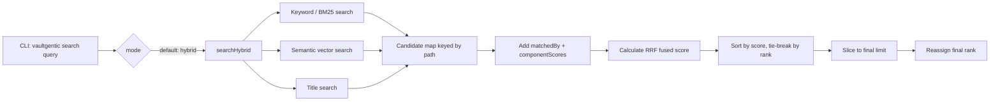

# PR #2 Reviewer Explainer: Hybrid Search Fusion

> [!NOTE]
> This explainer is meant to help reviewers orient around the behavior change, scoring model, and likely review risks. It is not a substitute for reviewing the diff.

## Summary

- Changes `vaultgentic search` default mode from `keyword` to `hybrid`.
- Adds hybrid search fusion across **keyword/BM25**, **semantic vector**, and **title** search.
- Merges duplicate note paths into one result with component-level match details.
- Uses reciprocal rank fusion instead of comparing raw component scores directly.
- Adds JSON and human `--scores` output for component ranks/scores.
- Adds tests for default hybrid behavior, duplicate merging, missing component scores, score output, and invalid modes.

## Main reviewer questions

| Question | Why it matters |
|---|---|
| Is changing the default from `keyword` to `hybrid` acceptable? | Existing CLI users may see different ordering and broader result types. |
| Are the hybrid limits right? | The PR uses keyword `40`, semantic `40`, title `10`, then slices to the requested final limit. |
| Should title matches be weighted `1.5x`? | Titles and aliases get more ranking influence than keyword/vector components. |
| Is the JSON output shape acceptable? | Hybrid results include `matchedBy` and `componentScores`, which may affect consumers. |

## Behavior before and after

| Area | Before | After |
|---|---|---|
| Default search mode | `keyword` | `hybrid` |
| Search sources | BM25 only | BM25 + semantic vector + title |
| Duplicate handling | Not applicable across modes | Results are merged by `path` |
| Final score | Component-specific score | Fused RRF score |
| Debug output | Basic score | Fused score plus component ranks/scores |

## Execution flow



## Scoring model

The implementation avoids comparing raw BM25/vector/title scores directly. Instead, each component contributes based on its rank.

```txt
component contribution = weight / (60 + componentRank)
```

Weights:

| Component | Weight |
|---|---:|
| `keyword` | `1` |
| `vector` | `1` |
| `title` | `1.5` |

Example contributions:

| Match | Contribution |
|---|---:|
| Rank 1 keyword | `1 / 61 = 0.0164` |
| Rank 3 vector | `1 / 63 = 0.0159` |
| Rank 1 title | `1.5 / 61 = 0.0246` |

> [!IMPORTANT]
> The raw component scores are still included for visibility, but they do not drive final cross-component ranking directly.

## Code map

| File / area | What changed | Reviewer focus |
|---|---|---|
| `apps/cli/src/index.ts` / `SearchMode` | Adds `hybrid` as a valid mode. | Confirm mode parsing and invalid mode errors still behave correctly. |
| `createProgram()` | Changes default `--mode` from `keyword` to `hybrid`. | This is the main compatibility-impacting change. |
| `search()` | Routes hybrid mode to `searchHybrid()`. | Confirm non-hybrid modes still use existing paths. |
| `searchHybrid()` | Runs keyword, semantic, and title searches, then fuses results. | Review limits, concurrency, sorting, slicing, and final rank reassignment. |
| `addHybridCandidate()` | Creates or updates a path-keyed candidate. | Confirm duplicate paths merge correctly. |
| `addHybridComponent()` | Adds component score/rank and adjusts fused score. | Check replacement behavior if the same component appears again with a better rank. |
| `formatSearchResult()` | Prints component scores in human `--scores` output. | Ensure non-hybrid output remains readable. |
| `apps/cli/src/index.spec.ts` | Adds hybrid search tests. | Confirm tests cover compatibility risks and edge cases. |

## Output contract

Hybrid JSON results now include a fused score and component-level details.

```json
{
  "rank": 1,
  "path": "alpha.md",
  "score": 0.04098,
  "matchedBy": ["keyword", "title"],
  "componentScores": {
    "keyword": { "rank": 1, "score": 2.13 },
    "title": { "rank": 1, "score": 1 }
  }
}
```

Notes:

- `score` is the final fused RRF score.
- `matchedBy` lists the components that matched this path.
- `componentScores` contains available components only.
- Missing components are omitted, not represented as `null` or `0`.

## Review callouts

> [!WARNING]
> **Default behavior change:** users who do not pass `--mode` now get hybrid results instead of keyword-only results.

> [!WARNING]
> **JSON consumers:** downstream scripts may see extra fields and different result ordering.

> [!TIP]
> **Ranking sanity check:** try queries where the title match is strong but body text is weak, and queries where semantic similarity should beat exact keyword matches.

> [!TIP]
> **Tie-break check:** when fused scores are equal, the implementation falls back to the original candidate rank. Review whether that tie-breaker is stable enough.

## Test coverage added

- Default hybrid JSON output includes fused component details.
- Keyword and title matches for the same note merge without duplicate results.
- Title-only matches omit missing keyword component scores.
- Human `--scores` output includes fused score and component ranks.
- Unsupported modes still produce a clear invalid-option error.

## Validation listed in the PR

```txt
pnpm --filter @vaultgentic/cli test
pnpm --filter @vaultgentic/cli build
pnpm --filter @vaultgentic/cli lint
pre-push turbo test
```

## Suggested reviewer checklist

- [ ] Confirm defaulting to `hybrid` is intentional and documented where needed.
- [ ] Review whether `keyword=40`, `semantic=40`, and `title=10` are reasonable retrieval depths.
- [ ] Review whether title weight `1.5` is product-correct.
- [ ] Confirm merged hybrid output preserves enough useful fields from the underlying result.
- [ ] Confirm JSON output changes are acceptable for CLI consumers.
- [ ] Run or inspect tests that cover duplicate merging and missing component scores.
